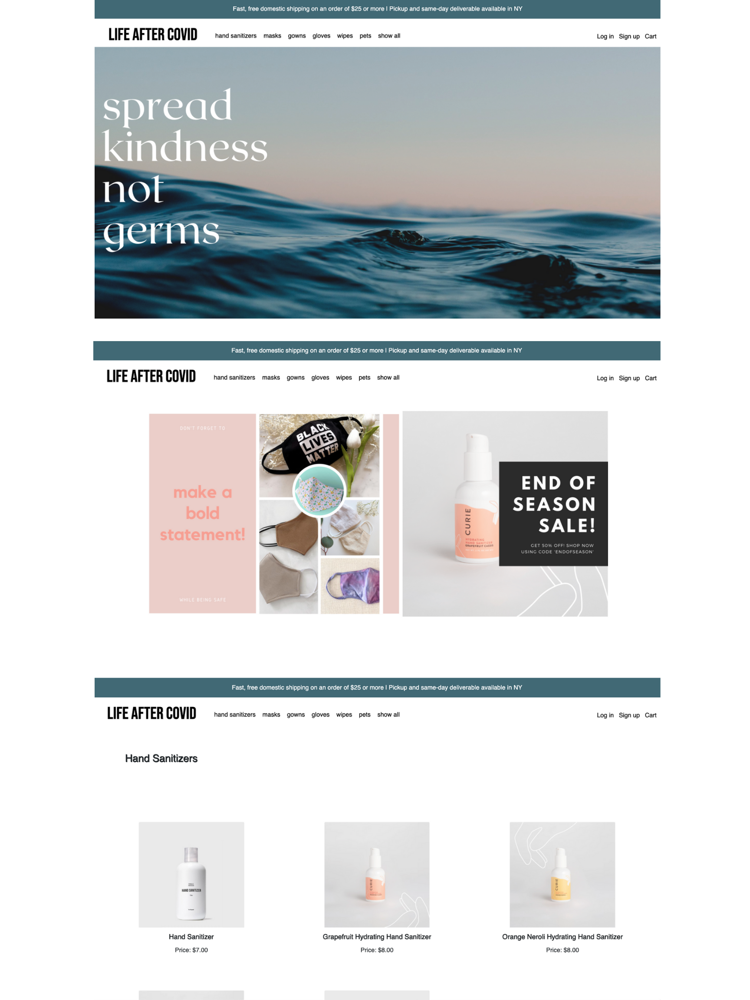
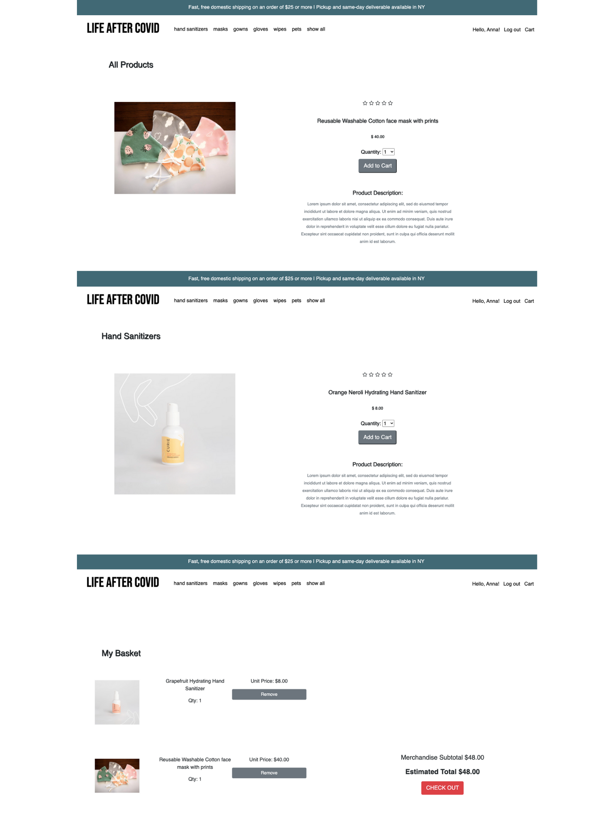

# Life After Covid
*Live Demo Coming Soon!*

Life After Covifd is a (SPA) single-page e-commerce web application that allows users to purchase PPE products. <br>
The inspiration of this app came to us while brainstorming for ideas on what problems we can attemp to resolve during this diffcult time. The products displayed in here have become neccessary items in our every day life. <br>
Users can navigate through a list of PPE products and select the products they wish to purchase. Once they click on each product they will see a description, reviews about the selected products submitted by other users, and the option to submit their own review and to add it to a cart.

## Take a Look! 📷

 </img>
 </img>

## Features
 
### CRUD Functionalities
 User can:
  * log in and/or create an account
  * browse all products or by specific category
  * see an error message if the account info input is wrong
  * write reviews on products
  * add items to their cart 
  * update their cart by removing items 
  * select specific quantity before adding items to cart
  * review cart's total dollar amount before checkout

### Active Record Associations
 * There are 6 models that have the following associations ```has_many, belongs_to and has_many, through: ```

## Domain Model
 </img>

## Tech Stack
 * Ruby on Rails
 * Rails as an API
 * PostgreSQL
 * HTML/CSS
 * Active Record
 
## Tools
 * Bootstrap for styling
 
## Gems 
 * rack-cors
 * active_model_serializers
 
## Build Status
 This project is currently work in progress.
 
## Future Features
 * Improve design elements (look of buttons, background image, text manipulation)
 * Create a chekout Function
 * Add review average on each product
 * Update user information
 * Allow users to upload a profile picture
 
 ## Set-up for running the app
 
 * Clone this <a href = "https://github.com/iannakim/Life-After-Covid-backend"> repo </a> into your local computer
 * cd into the repository you just cloned and run bundle install in the command line to ensure all the gems are set in your local system 
 * run rails db:migrate to migrate all the tables for the backend 
 * run rails db:seed, to create the seed data
 * open index.html from this <a href = "https://github.com/iannakim/Mod-3-Project"> repo </a> and you can start testing the SPA
 
 
## Contributors
 * [Anna Kim](https://github.com/iannakim)
 * [Franklin Bado](https://github.com/fbado66)
 
